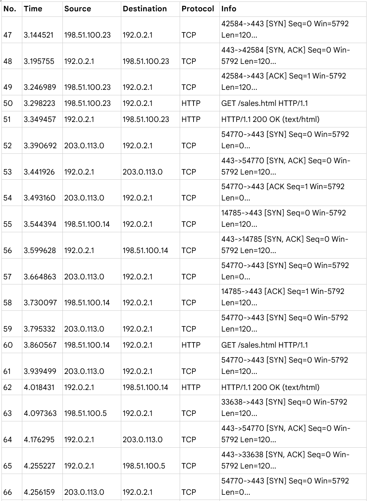
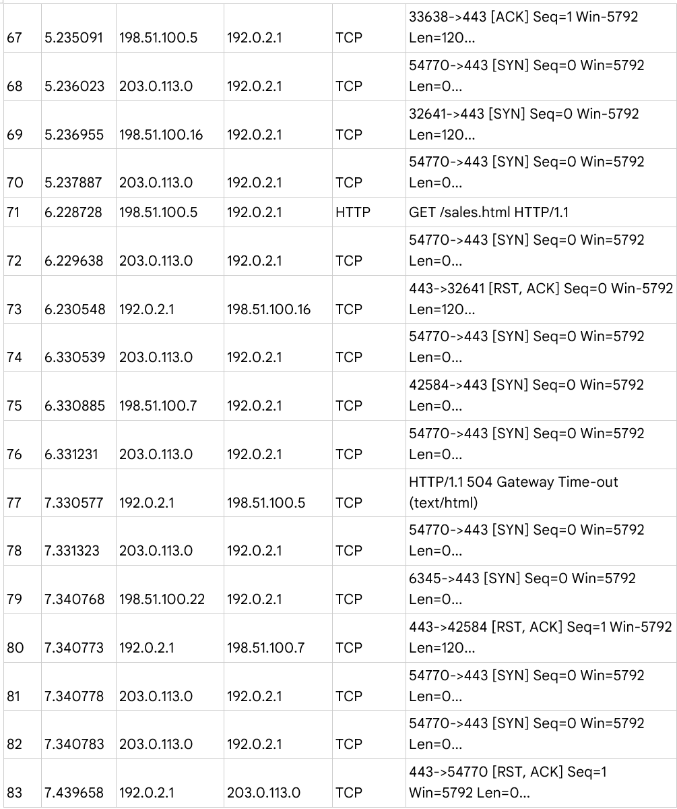
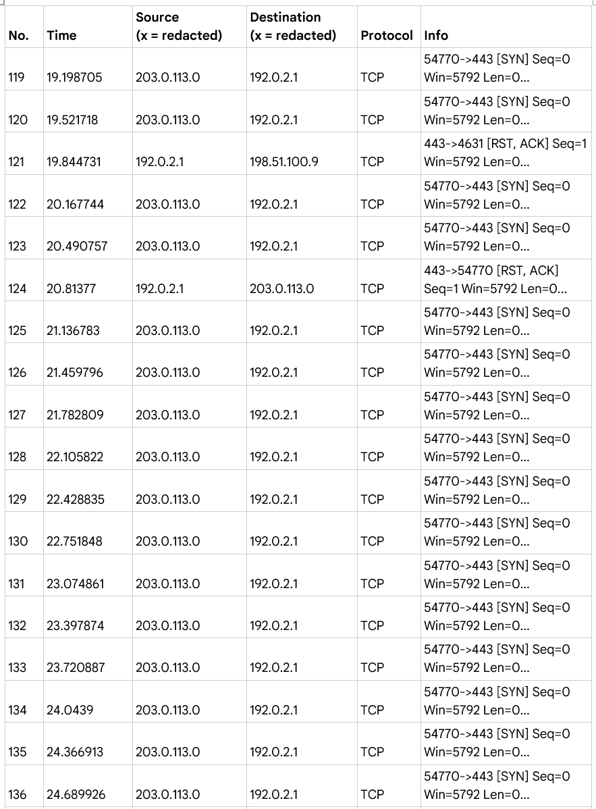
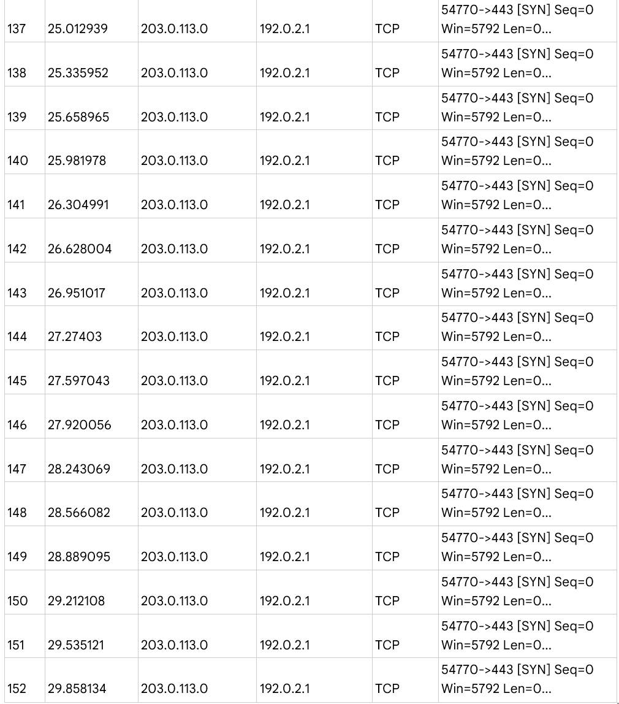

Google Cybersecurity Certificate
---
---
>🏆 **Certificate Credentials**: [Google Cybersecurity Certificate on Coursera](https://www.coursera.org/account/accomplishments/specialization/6UYSUTT96U9Z)
> 
<h2 style="color:blue">Table of Content</h2>
### List of study cases
- [Network Traffic Analysis](#network-traffic-analysis)
- [Network Attacks Analysis](#network-attacks-analysis)
- [Apply OS Hardening Tecniques](#apply-os-hardening-techniques)
- [Analysis of Network Hardening](#analysis-of-network-hardening)
## Network Traffic Analysis
> In this scenario, you are a cybersecurity analyst at a company that provides IT services. Several clients reported that they could not access a specific website and encountered the "destination port unreachable" error. Your task is to analyze the network issue and identify the affected protocol. To begin, you attempt to access the website and experience the same error. To investigate further, you use the network analyzer tool tcpdump while attempting to reload the webpage. The browser sends a DNS query using the UDP protocol to obtain the IP address of the domain. This IP address is then used in an HTTPS request to the web server. However, the network analyzer reveals that when UDP packets are sent to the DNS server, ICMP packets return an error message: "udp port 53 unreachable." Your analysis will focus on understanding the impact of these DNS and ICMP interactions on the network's security and identifying the underlying issue.
>
> Below is the tcpdump log  
> 

### Overview
The UDP protocol reveals that the DNS server for the website whose domain name is yummyrecipeforme.com is facing an error.

This is based on the results of the network analysis, which show that the ICMP echo reply returned the error message: “udp port 53 unreachable”.

Port 53 of UDP is used for receiving DNS requests and returning an IP address of the corresponding website.

This may indicate a problem with the DNS server that is hosting the website. It is possibly being flooded with a large number of requests, a type of Denial of Service (DoS) attack.

### Investigation and Analysis
At about 1:20 PM, many customers of our client company, Yummy Recipes For Me reported that they were unable to access the website.

Explain the actions taken by the IT department to investigate the incident: The IT department tried to access the website address and used the network analyzer tool to inspect the issue.

After sending UDP packets to the DNS server, ICMP packets are received indicating that port 53 was unreachable. Port 53 of it is already shut down and not receiving any requests. The issue is further evident by the plus sign flag following the query number 35084. There is also a flag associated with the DNS request for an A record, which maps a domain name to an IP address.  Our next steps include inspecting the server itself to find the source of flooding requests, troubleshooting and recovering the normal operation of the server. The DNS server can be down or traffic to port 53 is blocked by the firewall. The DNS server might be down due to a successful Denial of Service or a misconfiguration.

The IT department believes that a group of threats is trying to degrade the performance of the websites hosted by the DNS service provider and damage that DNS service provider. The threat actors are likely to be a competitor of that company.

## Network Attacks Analysis
> In this scenario, you are a security analyst for a travel agency that relies on its website to promote sales and vacation packages. One afternoon, your monitoring system alerts you to an issue with the web server. When you try to access the website, you encounter a connection timeout error. Using a packet sniffer, you discover that the web server is receiving an overwhelming number of TCP SYN requests from an unfamiliar IP address, indicating a potential SYN flood attack. The server is struggling to handle the excessive traffic, leading to service disruption. You temporarily take the server offline to allow it to recover and configure the firewall to block the suspicious IP address. However, you realize that this is a temporary solution, as the attacker could use IP spoofing to bypass the block. You must quickly inform your manager about the attack, discuss further actions to mitigate the threat, and prepare to explain the type of attack and its impact on the web server and company employees.
> 
> **Table: Wireshark TCP HTTPS logs** '
> 
> 
> 
> 

### Overview
One potential explanation for the website's connection timeout error message is: the web server is probably down and unable to respond to the coming requests, making them wait for a long time.

The logs show that: a suspicious device with an external IP address 203.0.113.0 kept sending synchronize request to the web server making the server resource unavailable and causing traffic problem for other requests. The issue happened in the transport layer of TCP/IP model where the TCP is responsible for transmitting data packets.

This event could be a successful Smurf attack causing DoS as it is from a single device.

### Explanation and Possible Measurement
When website visitors try to establish a connection with the web server, a three-way handshake occurs using the TCP protocol.
1.	The visitors’ devices send SYN packets to the web server asking for connection.

2.	The [SYN, ACK] packet is sent as a response of the server accepting the visitor’s request and reserve resources for the final step of the handshake.

3.	The [ACK] packet sent from the visitor’s machine acknowledging the permission to connect.

The first SYN request of the malicious actor was already accepted but that device kept sending a large number of SYN packets aiming to flood the server and slow the traffic. The server’s resources became unavailable, overwhelmed and finally unable to respond to the requests.

Explain what the logs indicate and how that affects the server:
The logs indicate that the server struggled to respond to the legitimate requests from the employees. The [RST, ACK] packets were sent to the requesting visitor, and they received a timeout error message as the [SYN, ACK] requests were not received by the server. The server finally stopped responding to any request (from log item number 125)

This is probably because the malicious actor spoofed an authorized IP address to conduct a DoS attack targeting the web server.

The next step is to investigate the IP address that flooded the server and send a report to the authorities.

One possible measure is to configure the server’s firewall to block any suspicious IP address automatically. For instance, familiar IP address but suddenly from a strange geographical location. Installing a new generation firewall (NGFW) can monitor any unusual traffic on the network. NGFW includes features that detect network anomalies to ensure that oversized broadcasts are detected before they have chance to bring down the network.

## Apply OS hardening techniques
**Source:** [Google Cybersecurity on Coursera](https://www.coursera.org/learn/networks-and-network-security/quiz/6XQKU/activity-apply-os-hardening-techniques/attempt)

**Summary of Scenario**

In this scenario, a cybersecurity analyst for yummyrecipesforme.com investigates a security breach where a former employee, known as "the baker," executed a brute force attack to access the website's admin panel. After successfully guessing the default password, the attacker embedded malicious JavaScript in the website’s source code. This code prompts visitors to download a file containing malware, redirecting them to a fake version of the site, greatrecipesforme.com, which further compromises their systems.

Several customers reported being prompted to download a suspicious file, leading to their computers slowing down after visiting the website. When the website owner attempted to log into the admin panel, they discovered they were locked out, prompting an investigation.

As part of the analysis, the cybersecurity team creates a sandbox environment and uses tcpdump to monitor the network. Upon visiting the website, the analyst is prompted to download an executable file. Running the file causes a redirect to the malicious website, confirming the presence of malware in the system.

>📝 **What have been done** (extracted from the [original page](https://www.coursera.org/learn/networks-and-network-security/quiz/6XQKU/activity-apply-os-hardening-techniques/attempt)):
> 
> **1. The logs show the following process:**
> 
> + The browser initiates a DNS request: It requests the IP address of the yummyrecipesforme.com URL from the DNS server. 
> + The DNS replies with the correct IP address.
> + The browser initiates an HTTP request: It requests the yummyrecipesforme.com webpage using the IP address sent by the DNS server. 
> + The browser initiates the download of the malware. 
> + The browser initiates a DNS request for greatrecipesforme.com. 
> + The DNS server responds with the IP address for greatrecipesforme.com. 
> + The browser initiates an HTTP request to the IP address for greatrecipesforme.com. 
> 
> **2. A senior analyst confirms that the website was compromised.** 
> 
> The analyst checks the source code for the website. They notice that javascript code had been added to prompt website visitors to download an executable file. Analysis of the downloaded file found a script that redirects the visitors’ browsers from yummyrecipesforme.com to greatrecipesforme.com. 
> 
> **3. The cybersecurity team reports that the web server was impacted by a brute force attack.**
> 
> The disgruntled baker was able to guess the password easily because the admin password was still set to the default password. Additionally, there were no controls in place to prevent a brute force attack.  

<h3 style="color:green">Security Incident Report</h3>

    <b style="color: blue">Section 1: Identify the network protocol involved in the incident</b>
    
The network protocol involved in the incident is the Hypertext transfer protocol (HTTP). As we ran tcpdump and accessed the yummyrecipesforme.com website, the tcpdump logs indicate the HTTP GET request to download the malicious file. All the incident occurred on the application layer.

 

    <b style="color: blue">Section 2: Document the incident</b>
    

    <b>Where/when/who discovered/how they detect the incident:</b>
    

At about 2 PM, multiple customers of the company sent emails saying that their personal computers were slowing down after accessing our main website and being prompted to download a file for free recipes. The website administrator tried to log in the account to check but he lost his credential for that account.

The IT team created a sandbox environment to investigate and troubleshoot the issue, as it prevented the whole system from being affected by the malicious code.

Then the security analyst ran tcpdump to capture the network traffic packets produced by interacting with website.

<b>What cybersecurity department did and observed?</b>

The cybersecurity analyst used a sandbox environment to open the website without impacting the company network. Then, the analyst ran tcpdump to capture the network traffic packets produced by interacting with the website. The analyst was prompted to download a file claiming it would provide access to free recipes, accepted the download and ran it. The browser then redirected the analyst to a fake website (greatrecipesforme.com).

<b>Analyze the tcpdump log:</b>

The cybersecurity analyst inspected the tcpdump log and observed that the browser initially requested the IP address for the yummyrecipesforme.com website. Once the connection with the website was established over the HTTP protocol, the analyst recalled downloading and executing the file. The logs showed a sudden change in network traffic as the browser requested a new IP address for the greatrecipesforme.com URL. The network traffic was then rerouted to the new IP address for the greatrecipesforme.com website.

<b>What are other resources/evidence?</b>

A senior analyst concluded that the source code of the website was injected with a JavaScript code to prompt the visitors to download that malicious file.

The cybersecurity team reported that the website was impacted by a brute force attack. The administrator account was left with default password, so a former employee exploited by logging in with random common passwords and gain the access. That employee also changed the password after his attack.

<b>Next step to recover</b>

The developer team is modifying our source code, and we are discussing methods to harden the security of the system.

 

    <b style="color: blue">Section 3: Recommend one remediation for brute force attacks</b>

Currently, there are no prevention measures to protect the system from brute force attacks. 
-	Stronger password policies for accounts of admin, employees and customers must be developed and forced to comply so that passwords cannot be easily guessed by humans and computers. As the admin account is using a default password, the brute force attacker could be able to gain access by guessing the password.
-	Multi-factor authentication with facial recognition and OTP should be applied for significant accounts like admin accounts to ensure the identity of the user who is trying to log in. Threat actors who are trying to log in legally are not able to have the OTP for additional authentication.
-	The system should be able to alert when the limit number of log in attempts is exceeded, preventing similar brute force attacks in the future.

## Analysis of Network Hardening
**Source:** [Google Cybersecurity on Coursera](https://www.coursera.org/learn/networks-and-network-security/quiz/9tlOr/activity-analysis-of-network-hardening/view-attempt

**Activity Overview** (extracted from the [original page](https://www.coursera.org/learn/networks-and-network-security/quiz/9tlOr/activity-analysis-of-network-hardening/view-attempt)))

You are a security analyst working for a social media organization. The organization recently experienced a major data breach, which compromised the safety of their customers’ personal information, such as names and addresses. Your organization wants to implement strong network hardening practices that can be performed consistently to prevent attacks and breaches in the future. 

> **After inspecting the organization’s network, you discover four major vulnerabilities. The four vulnerabilities are as follows:**
> 
> + The organization’s employees' share passwords. 
> + The admin password for the database is set to the default. 
> + The firewalls do not have rules in place to filter traffic coming in and out of the network. 
> + Multifactor authentication (MFA) is not used. 
> + If no action is taken to address these vulnerabilities, the organization is at risk of experiencing another data breach or other attacks in the future. 

<h3 style="color:green">Security Risk assessment Report</h3>

    <b style="color: blue">Part 1: Select up to three hardening tools and methods to implement</b>

Three hardening tools and methods the organization can use to address the vulnerabilities found include:
1.	Encrypting sensitive data using latest standards
2.	Performing firewall maintenance regularly
3.	Implementing Multifactor authentication (MFA)

Encryption conceals outgoing data and uncovers or decrypts the incoming data.

Firewall maintenance entails checking and updating security configurations regularly to stay ahead of potential threats.

MFA requires users to use more than one way to identify and verify their credentials before accessing an application. Some MFA methods include fingerprint scans, ID cards, pin numbers, and passwords.

 

    <b style="color: blue">Part 2: Explain your recommendations</b>

The first method that should be implemented is the Multifactor authentication (MFA). Currently, employees are illegally sharing passwords with each other. This would have given a chance for non-privileged people to gain access to sensitive data. MFA is a security measure which requires additional verification of the user trying to log in. Only authorized people with specific OTP, fingerprint of facial recognition have login credentials.

Another measure is to do regular firewall maintenance, especially after a data breach. Traffic from sources that are suspicious should be placed on a denied traffic list. Potential threats and firewall rules should be up to date to configure properly on the firewall. Stateful firewall and next-generation firewall (NGFW) should be installed to monitor and filter out any abnormal network traffic. Not only will this prevent illegal access, but it will also protect the network against various DDoS attacks.

Last but not least, any sensitive data such as SPII or PII must be encrypted with advanced algorithm under the latest standards. Only authorized people have the key to decrypt the encrypted data. Therefore, even if the data storage is intruded, the malicious actors still cannot take advantage of it to cause harmful effects on the organization and our customers.

